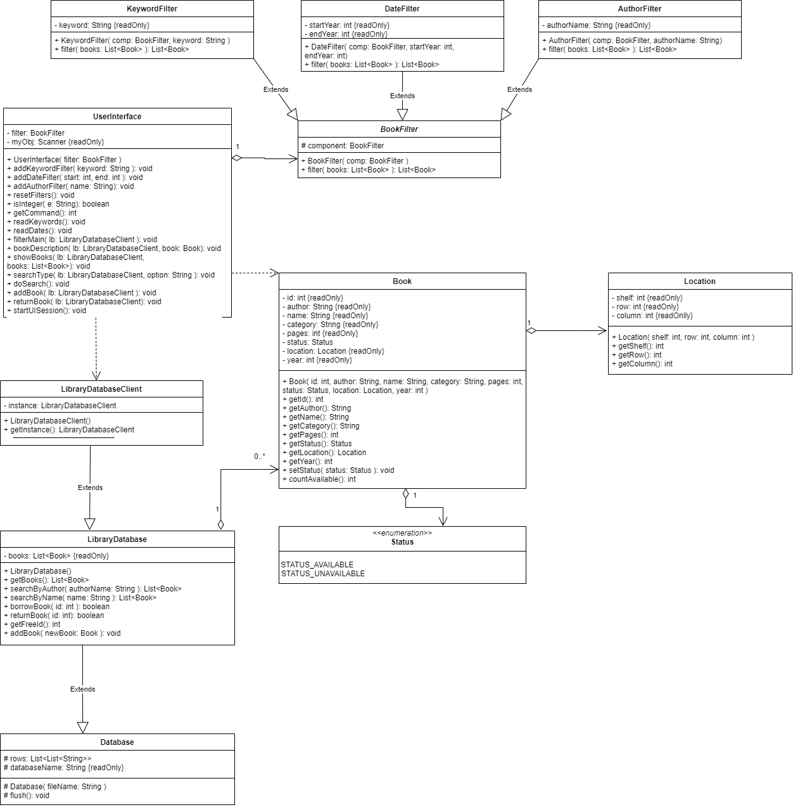

# Book Finder Project


<h3>Participants</h3>
* Emil Latypov B20-03 (e.latypov@innopolis.university)
* Azamat Shakirov B20-03 (a.shakirov@innopolis.university)
* Bekzat Rakhimbayev B20-03 (b.rakhimbayev@innopolis.university)
* Shohjahon Khamrakulov B20-03 (s.khamrakulov@innopolis.university)
* Arlan Kuralbayev B20-03 (a.kuralbayev@innopolis.university)

<hr>

##  Note


> As we have class <u>LibraryDatabase</u>, it could seem that it represents connection to database and can break principle of single responsibility. **But** this class was designed in other way: it is some wrapper over low level database, which purpose is to **provide** useful interfaces specified only for this special purpose. It is **not** just connection to database, each of its method was designed only to simplify database calls. Therefore, we do not violate SOLID principles here.


<h3>Project Description</h3>

(see change log at the end)

<b>Book Finder</b> was developed to organize and manage work of library.
The library system has Database of books and UI to interact with users. 

<b>Library Database</b> (remote representation of database) stores list of books, which are represented as .csv file. After each change the actual information is updating and saving in the file. Books contain name, author, number of pages, category, year of publication, location and status. To make it easier to find the book, the application provides the user with information about the shelf, row and column number,  where book is located. After borrowing the book becomes inaccessible to other users until  it is returned.

<b>UserInterface</b> is a wrapper, which provides to the user an opportunity to look for 
books of interest to him by <i>book name</i> or <i>author name</i>, borrow available books and
return them and add a new ones by terminal. UserInterface provides opportunity to **Filter** books by different fields: keywords, authors and publication dates.

<h3>Available features:</h3> 
* Search any book by name or by author
* Get basic information about books such as name, author, category, realized year, page number etc.
* Keep track location of any book by just shelf, column and row number
* Easy to track book's status if book is borrowed by someone or not
* If book status is available, there is an option to borrow
* Return borrowed book by just entering its ID 
* Add new book to database
* Filtering books by some criteria

<hr>
<h3>How to use</h3>
<b>Book Finder</b> has user-friendly and easy to use User Interface on terminal.
Limiting user control on Program by applying numbers for 
each command and it helps to use commands like real application buttons. <br>
It is carefully ensured that user can only enter numbers that belong to available commands, 
program keeps giving notifications until user enters valid input. <br>
For example: <br>

```
TODO: CHANGE EXAMPLE

-----------------------------------------
Welcome to Book Finder
-----------------------------------------
Please choose following commands:
0 -> Search
1 -> Return book
2 -> Add new book
3 -> Exit
Enter number >> 0

-----------------------------------------
SEARCHING!
-----------------------------------------
Please choose following commands:
0 -> Search by Name
1 -> Search by Author
2 -> Go Back
Enter number >> 0

-----------------------------------------
SEARCHING BY NAME
-----------------------------------------
0 -> Go Back
Please choose commands or Search: agile
--------------------------------
FOUND RESULTS:
0 --> Agile Web Development with Rails BY: Sam Ruby, Dave Thomas, David Heinemeier Hansson
1 --> Agile web development with rails: a Pragmatic guide BY: Dave Thomas, David Heinemeier Hansson, Leon Breedt, Mike Clark, Thomas Fuchs, Andrea Schwarz
2 --> Agile.Web.Development.with.Rails.4th.Edition BY: the pragmatic programmers
Choose book from results
Enter number >> 0

-----------------------------------------
BOOK DESCRIPTION
-----------------------------------------
ID: 0
Name: Agile Web Development with Rails
Author: Sam Ruby, Dave Thomas, David Heinemeier Hansson
Category: Web development
Year: 2010
Pages: 472
Location -> shelf: 4 column: 3 row: 3
Status: Available
------------------------------------
0 -> Borrow book
1 -> Go Back
Enter number >> 0
You have successfully borrowed book with id = 0
-----------------------------------------
Welcome to Book Finder
-----------------------------------------
Please choose following commands:
0 -> Search
1 -> Return book
2 -> Add new book
3 -> Exit
Enter number >>
```

etc.


And usage of new functionality of filter:

```
-----------------------------------------
Welcome to Book Finder
-----------------------------------------
Please choose following commands:
0 -> Search
1 -> Return book
2 -> Add new book
3 -> Filter books
4 -> Exit
Enter number >> 3

-----------------------------------------
FILTERING
-----------------------------------------
REMINDER: If you don't want to filer by specific elements, just leave input empty!
Enter keywords: Agile
Enter start year: 2000
Enter end year: 2005
FOUND RESULTS: 
0 --> Agile web development with rails: a Pragmatic guide BY: Dave Thomas, David Heinemeier Hansson, Leon Breedt, Mike Clark, Thomas Fuchs, Andrea Schwarz
Choose book from results
Enter number >> Please enter only digit!!!
Enter number >> 0

-----------------------------------------
BOOK DESCRIPTION
-----------------------------------------
ID: 2
Name: Agile web development with rails: a Pragmatic guide
Author: Dave Thomas, David Heinemeier Hansson, Leon Breedt, Mike Clark, Thomas Fuchs, Andrea Schwarz
Category: 'Web site development -- Handbooks, manuals, etc.','Ruby (Computer program language) -- Handbooks, manuals, etc.','Sites Web -- DeРњРѓveloppement -- Guides, manuels, etc.','Ruby (Langage de programmation) -- Guides, manuels, etc.'
Year: 2005
Pages: 554
Location -> shelf: 3 column: 5 row: 5
Status: Available
------------------------------------
0 -> Borrow book
1 -> Go Back
Enter number >> 1
-----------------------------------------
Welcome to Book Finder
-----------------------------------------
Please choose following commands:
0 -> Search
1 -> Return book
2 -> Add new book
3 -> Filter books
4 -> Exit
Enter number >> 3

-----------------------------------------
FILTERING
-----------------------------------------
REMINDER: If you don't want to filer by specific elements, just leave input empty!
Enter keywords: Web
Enter start year: 2006
Enter end year: 2015
FOUND RESULTS: 
0 --> Agile Web Development with Rails BY: Sam Ruby, Dave Thomas, David Heinemeier Hansson
1 --> Alex Homer, ASP.NET 2.0 Visual Web Developer 2005 BY: David Sussman
2 --> PHP Oracle Web Development: Data processing, Security, Caching, XML, Web Services, and Ajax: A practical guide to combining the power, performance, scalability, ... time, and high performance of PHP BY: Yuli Vasiliev
3 --> WordPress for Web Developers: An Introduction for Web Professionals BY: Stephanie Leary (auth.)
4 --> MODx Web Development BY: Antano Solar John, Antano Solar John
5 --> Grok 1.0 Web Development BY: Carlos de la Guardia
6 --> Professional JavaScript for Web Developers BY: Nicholas C. Zakas
7 --> Agile.Web.Development.with.Rails.4th.Edition BY: the pragmatic programmers
8 --> Beginning CSS Web Development: From Novice to Professional BY: Simon Collison
9 --> Beginning PHP 6, Apache, MySQL 6 Web Development BY: Timothy Boronczyk
10 --> Beginning Smartphone Web Development: Building Javascript, CSS, HTML and Ajax-Based Applications for iPhone, Android, Palm Pre, Blackberry, Windows Mobile and Nokia S60 BY: Gail Frederick, Rajesh Lal
11 --> The Microsoft Expression Web Developer's Guide to ASP.NET 3.5: Learn to create ASP.NET applications using Visual Web Developer 2008 BY: Jim Cheshire
12 --> Tapestry 5: Building Web Applications: A step-by-step guide to Java Web development with the developer-friendly Apache Tapestry framework BY: Alexander Kolesnikov
13 --> Tapestry 5: Building Web Applications: A step-by-step guide to Java Web development with the developer-friendly Apache Tapestry framework BY: Alexander Kolesnikov
14 --> PHP 5 Fast and Easy Web Development (Fast and Easy Web Development) BY: Julie C. Meloni
15 --> Macromedia Flash MX 2004 Fast & Easy Web Development (Fast & Easy Web Development) BY: Lisa A. Bucki
16 --> PHP Oracle Web Development: Data processing, Security, Caching, XML, Web Services, and Ajax: A practical guide to combining the power, performance, ... development time, and high performance of PHP BY: Yuli Vasiliev
17 --> Tapestry 5: Building Web Applications: A step-by-step guide to Java Web development with the developer-friendly Apache Tapestry framework BY: Alexander Kolesnikov
18 --> Learn Java for Web Development: Modern Java Web Development BY: Vishal Layka
19 --> Flask Web Development: Developing Web Applications with Python BY: Miguel Grinberg
20 --> Flask Web Development: Developing Web Applications with Python BY: Miguel Grinberg
21 --> Developing Web Apps with Haskell and Yesod: Safety-Driven Web Development BY: Michael Snoyman
22 --> Developing Web Apps with Haskell and Yesod: Safety-Driven Web Development BY: Michael Snoyman
23 --> Web Design for Developers: A Programmer's Guide to Design Tools and Techniques (The Pragmatic Programmers) BY: Brian P. Hogan
24 --> GIS for Web Developers: Adding Where to Your Web Applications (2007)(en)(254s) BY: Scott Davis
25 --> Spring Web Flow 2 Web Development BY: Sven Lüppken, Markus Stäuble
26 --> Catalyst - Accelerating Perl Web Application Development BY: Jonathan Rockway
27 --> Spring Web Flow 2 Web Development BY: Sven Lüppken, Markus Stäuble
28 --> GIS for Web Developers: Adding 'Where' to Your Web Applications BY: Scott Davis
29 --> Even Faster Web Sites: Performance Best Practices for Web Developers BY: Steve Souders
30 --> Spring Web Flow 2 Web Development BY: Sven Lüppken, Markus Stäuble
31 --> Developing Large Web Applications: Producing Code That Can Grow and Thrive BY: Kyle Loudon
32 --> Even Faster Web Sites: Performance Best Practices for Web Developers BY: Steve Souders
33 --> Even Faster Web Sites: Performance Best Practices for Web Developers BY: Steve Souders
34 --> Spring Web Flow 2 Web Development BY: Sven Luppken, Markus Stauble
35 --> Communicating Design: Developing Web Site Documentation for Design and Planning (2nd Edition) (Voices That Matter) BY: Dan M. Brown
36 --> Weaving a Library Web: A Guide to Developing Children's Websites BY: Helene Blowers
Choose book from results
Enter number >> Please enter only digit!!!
Enter number >> 
```


<hr>
<h3>Project structure</h3>
At the beginning of the program, the control is forwarded into <u>UserInterface</u>'s 
<b>startUISession</b> function. <u>UserInterface</u> is responsible for any communications
with user, and each of its function helps with that.
During it's work it uses <u>LibraryDatabaseClient</u> which makes requests to <u>LibraryDatabase</u>. <u>LibraryDatabase</u> is a remote Database which stores information about books and provides some basic functionality to manipulate them and update database permanently (even in the disk).
LibraryDatabase is inherited from <u>Database</u> class, which works with 
the database file (.csv format) in low level and provides high-level methods 
to manipulate data, doesn't matter which fields are stored in table. 
<br>
<br>
<u>LibraryDatabaseClient</u> is a local representation of database which connects to remote LibraryDatabase and provides all interfaces on the local machine. <u>LibraryDatabaseClient</u> uses <b>Singleton</b> pattern because one device should have not more than one connection to remote centralized database, while remote database should be able to handle multiple users. Moreover, local database (a.k.a client) doesn't trigger remote database more than it is needed. Therefore, remote database doesn't have extra load, what leads us to great performance and fault tolerance (e.g. if remote database is down, only some functions become unavailable for existing connections).
<br>
<br>
Main structure we are working with in out program is class <u>Book</u>. It stores all the data
about book. Auxiliary class <u>Location</u> represents location of the book. Enum 
<u>Status</u> shows if book is free (<i>STATUS_AVAILABLE</i>) or borrowed (<i>STATUS_UNAVAILABLE</i>).


#####  Assignment 2 addition

We added new class <u>Filter</u> which helps to perform filtering operations. Moreover, we used **Decorator** pattern to implement that. We already implemented 3 types of filters: <u>AuthorFilter</u>, <u>KeywordFilter</u> and <u>DateFilter</u> which are the implementations of abstract <u>BookFilter</u> class. They help to filter all existing books by author, keywords and dates respectively. **For example**, if we want to search some book, which has keywords "Python" and "SQL", we can easily do this applying both keywords. Due to **Decorator** pattern we can easily apply multiple different filters and have great extensibility. This means that  we can easily implement new filter and it will be easy to integrate it into existing code.


##### Assignment 3 addition

We added **Chain of Responsibility**  pattern to make little optimization in filters: if we know that there is no books that satisfy condition of current *Filter*, then there is no need to check conditions of other filters as we know that the result will be empty. Moreover, as a container for Books we use <u>BooksCollection</u> class. For this class we implemented **Iterator** pattern to make it possible to run through the collection of books.


<hr>
<h3> Singleton usage</h3>
Singleton pattern is used to design our Library Database Client. It should 
be ensured that from any place of our program we are working with the same
connection to Library Database - doesn't matter if it is called from UserInterface or Book class.
In this task we used Classic Singleton implementation

### Decorator usage

Decorator pattern is used to design Filter class. It gives us an opportunity to easily extend our program by adding new filters and apply multiple filters at the same time. More information about this class is given upwards.

### Chain of Responsibility and Iterator usage

look at **Assignment 3 addition**


<h3>UML</h3>





### Change log (Assignment 2)

* Fix LibraryDatabase usage: now we have separate representation of database in "local" machine (<u>LibraryDatabaseClient</u>) and on the "remote server" (<u>LibraryDatabase</u>). 
* Add <u>BookFilter</u> class which allows to extends opportunities of searching. It uses **Decorator** pattern.
* Fix errors in documentation, report.
* Small fixes in code


### Change log (Assignment 3)

* Remove boilerplate code from <u>BookFilter</u> class and it's derivatives (move common used code from children to parent)
* Add <u>BooksCollection</u> class to store collection of books
* Implement **Iterator** pattern for <u>BooksCollection</u>
* Implement **Chain of Responsibility**  pattern for filters
* Fix code problems taking into account previous feedback
* Make changes in report taking into account feedback
* Code review, fix bugs